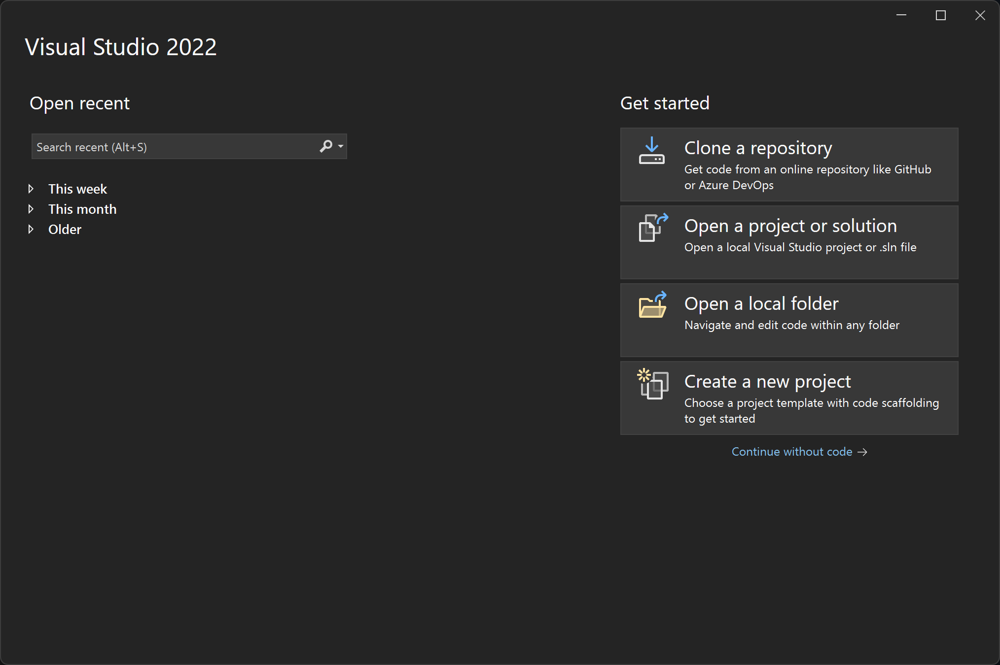
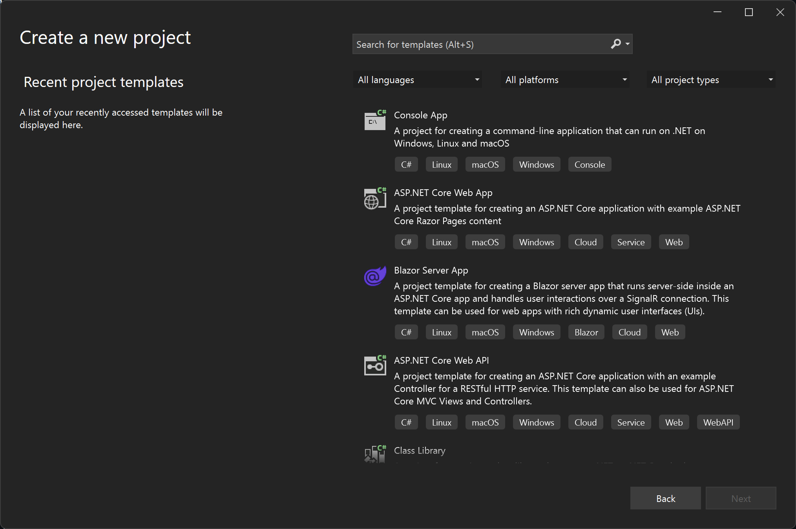
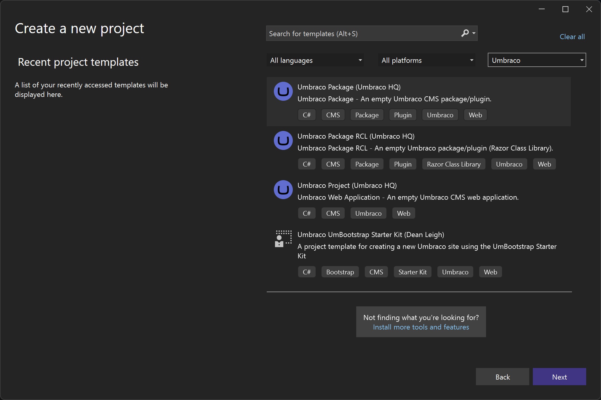
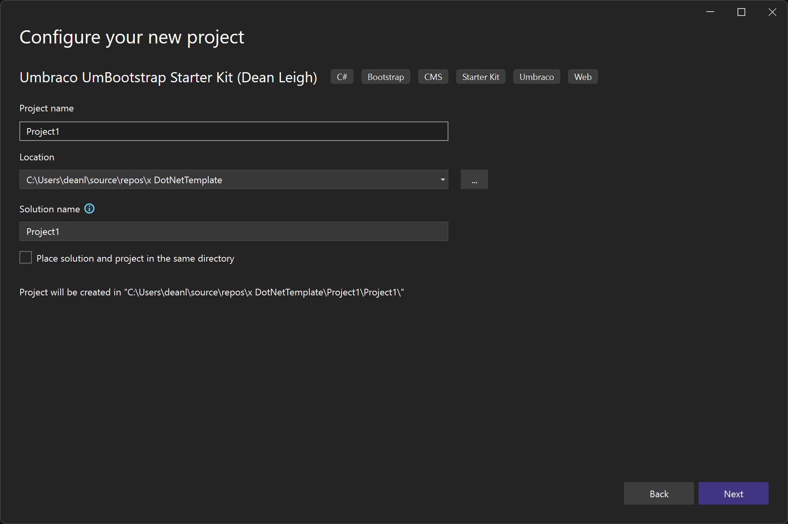

# UmBootstrap

## Description
UmBootstrap is an Umbraco Starter Kit, Template Library and Component Library.

What makes this different from other starter kits is that it is not installed via a Nuget Package on top of an existing Umbraco website, it is an Umbraco website on installation as a dotnet project template.

## Features

At the heart of UmBootstrap is an Umbraco website containing:
* Page layout templates
* Section layout templates
* Component templates

All of these are constructed using Umbraco doctypes and datatypes and Bootstrap HTML, CSS and JavaScript.

## Installation

### For Contributors
[Contributing to UmBootstrap](CONTRIBUTING.md) requires a different process to installing UmBootrap using the instructions intended for users.

Please refer to the following guide for instructions on how to contribute to UmBootstrap:
- [Contributing to UmBootstrap](CONTRIBUTING.md)

> [!WARNING] 
> Pull requests will not be accepted from users who have not followed the guidelines

### For Users
There are two ways for users to install UmBootstrap:
1. Using [.NET CLI](https://learn.microsoft.com/en-us/dotnet/core/tools/)
2. Using Visual Studio

> [!IMPORTANT] 
> If you wish to use UmBootstrap for its intended purpose:
> - You should install it using the [.NET CLI](https://learn.microsoft.com/en-us/dotnet/core/tools/) or Visual Studio
> - You should not use the UmBootstrap repository

#### .NET CLI

The ideal way to install UmBootstrap is a single command line:

    dotnet new umbootstrap -n MyWebsite

 #### Visual Studio

 To use the UmBootstrap Visual Studio project template:

#### 1. Create a new project

 

#### 2. Search for UmBootstrap or choose Umbraco from Project Type

#### 3. Select UmBootstrap and click Next

#### 4. Enter a project name and click Create

This will create a new Umbraco website with UmBootstrap already installed.

## Contributing
All contributions are welcome. Please read the [contributing guide](CONTRIBUTING.md) to get started.

## Usage

UmBootstrap is designed to be used as a starter kit for building websites. It is not a theme or a package. It is a website that you can use as a starting point for your own website.

However, it is not a blank canvas. It is a fully functional website with a variety of page and section templates and a rich component library.

This is ideal if you are new to Umbraco and want to learn how to build websites using Umbraco and Bootstrap.

However, for more experienced developers, you may find that you want to remove some of the templates and components that you don't need or copy and paste the ones that you do need into your own website.
